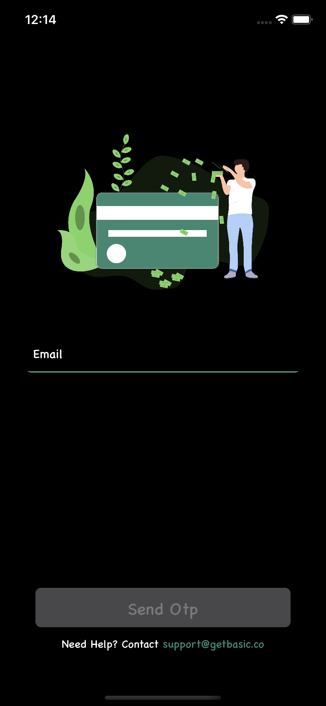
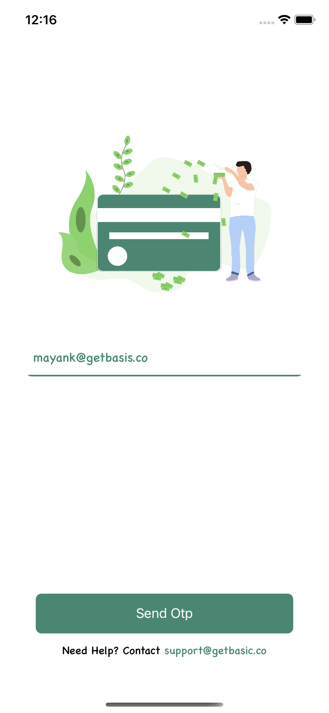
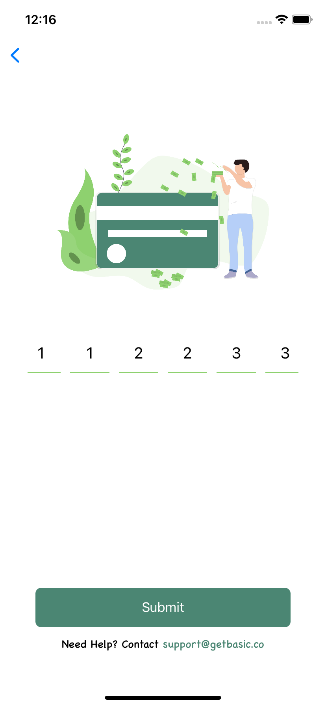

# Basis

## Features

- [x] Spash Screen
- [x] Email Screen
- [x] OTP Screen

Download the app in zip or run

```
git clone https://github.com/joysonjson/Basis.git
```

Then, run the following command:

```bash
$ pod install
Open Basis.xcworkspace , Build and run the app.
```

> :warning: ** Blocker **: 
> I was not able to proceed and finish the app because!
> The Api to verify the verification code was throwing 404 not found error. 

```
POST 'https://hiring.getbasis.co/candidate/users/email/verify/'
  Content-Type : application/json
  HttpBody : {"email":"mayank@getbasis.co","token":1655059422873,"verificationCode":"112233"}
404 'https://hiring.getbasis.co/candidate/users/email/verify/'
```

> **Note**
> I have supported ios 13 and above  just to take advantage of dark and light more
> I tried to use animation in launch screen
> Used MVVM Pattern
> URLSession for the network request
> Added validations for email as well as otp
> 


> :warning: ** NO TestCases **: 
> I was not able to add testcases








## License

Released under the [MIT License](http://www.opensource.org/licenses/MIT).
